# CV to VLM to VLA 第一阶段总结

## 一句话闭环

这一阶段不是为了堆论文数量，而是为了打通一个接口链路：

```text
camera image
-> visual backbone
-> visual tokens
-> image-text alignment
-> image-to-LLM bridge
-> visual instruction following
-> robot imitation learning dataset / policy
-> vision-language-action policy
-> LeRobot / SO-ARM101 data loop
```

更短地说：

```text
图像如何被模型理解
-> 图像如何和语言对齐
-> 图像如何进入 LLM
-> VLM 如何输出 text
-> robot policy 如何输出 action
```

## 第一阶段读过的主线材料

| 顺序 | 论文 / 材料 | 核心问题 | 阶段 takeaway |
|---|---|---|---|
| 1 | LeNet-5 | 能否从像素端到端学习视觉特征？ | CNN 基本语法成立：local receptive field、weight sharing、feature map、subsampling。 |
| 2 | AlexNet | CNN 能否在 ImageNet 大规模自然图像上成立？ | 大数据 + GPU + ReLU + dropout / augmentation 让 deep CNN 成为现代 visual backbone。 |
| 3 | VGG | 更深的 CNN 是否更强？ | 规则的 `3x3 conv` 堆叠证明 `depth matters`。 |
| 4 | ResNet | 深层 plain net 为什么继续加深反而更难训？ | `F(x) + x` residual path 解决 degradation / optimization 问题。 |
| 5 | ViT | 图像能不能变成 Transformer token sequence？ | `image -> patch tokens -> Transformer encoder`，为 VLM/VLA visual tokens 打基础。 |
| 6 | CLIP | 图像和文本如何进入同一语义空间？ | 双塔 contrastive learning 做 image-text alignment，得到 open-vocabulary grounding。 |
| 7 | BLIP-2 | 图像如何接入 frozen LLM？ | Q-Former 把 frozen image encoder 的视觉特征转成 language-aligned visual embeddings。 |
| 8 | LLaVA | VLM 如何按图像和指令回答？ | CLIP vision encoder + projector + LLM + visual instruction tuning。 |
| 9 | ALOHA / ACT | 真实机器人 imitation learning 如何采数据和训 policy？ | `teleop -> image/state/action dataset -> action chunk policy -> eval/failure`。 |
| 10 | RT-2 | VLM 如何变成 VLA？ | action-as-token，把 robot action 放进 VLM 的输出 token space。 |

## Key Pictures 总览

先看这张带注释的总图。它不是论文原图拼接，而是把本阶段读过的论文压成一条接口演化线：

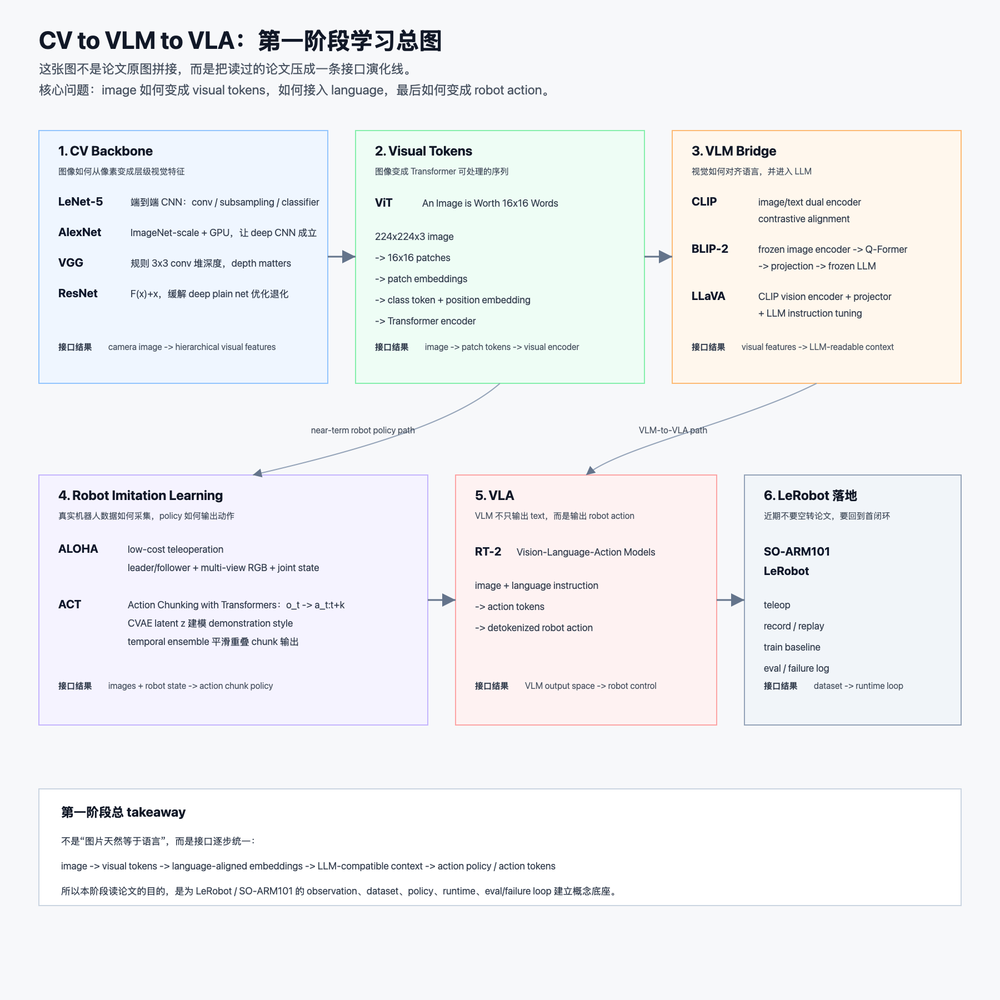

读图时不要按“模型越来越大”理解，而是按接口变化理解：

| 阶段 | 论文 / 材料 | 这一步解决的问题 | 接口变化 |
|---|---|---|---|
| CV Backbone | LeNet-5 / AlexNet / VGG / ResNet | 图像如何从像素变成可学习的层级视觉特征 | `image -> visual features` |
| Visual Tokens | ViT | 图像如何变成 Transformer 可以处理的 token sequence | `image -> patch tokens -> Transformer encoder` |
| VLM Bridge | CLIP / BLIP-2 / LLaVA | 视觉如何和语言对齐，如何进入 LLM 并按 instruction 回答 | `visual features -> language-aligned embeddings -> LLM context` |
| Robot Imitation Learning | ALOHA / ACT | 真实机器人如何采 demo，如何从 observation 预测 action | `images + state -> action chunk policy` |
| VLA | RT-2 | VLM 如何不只输出 text，而是输出 robot action | `image + language -> action tokens -> robot action` |
| LeRobot 落地 | SO-ARM101 / LeRobot | 近期怎么把这条线落成 teleop / record / replay / eval | `dataset -> policy -> runtime -> failure log` |

如果要看原始论文架构图的视觉记忆，再看下面这张 contact sheet：

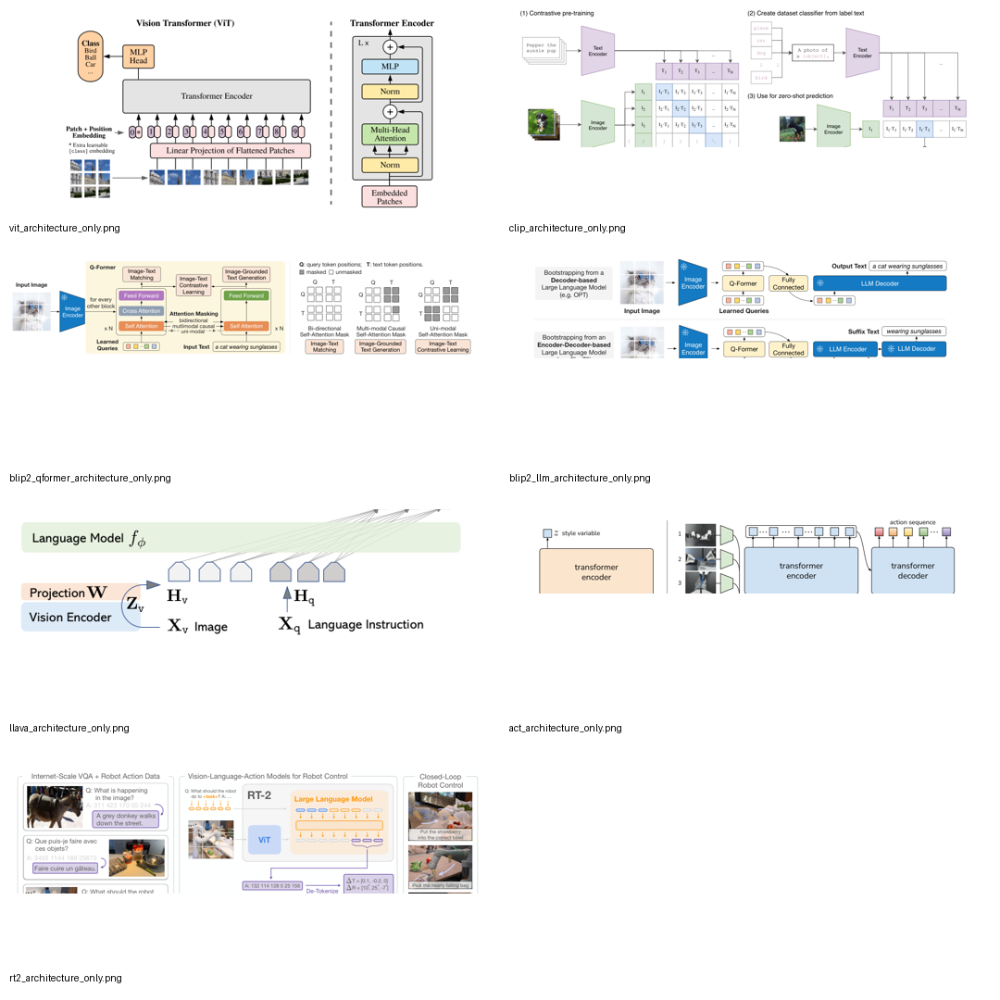

原始架构图读图顺序：

```text
LeNet / AlexNet / VGG / ResNet:
  image -> convolutional visual features

ViT:
  image -> patch tokens -> Transformer encoder

CLIP / BLIP-2 / LLaVA:
  visual features -> language alignment -> LLM bridge -> instruction response

ALOHA / ACT / RT-2:
  robot observation -> policy -> action chunk / action tokens
```

## 阶段 1：CV Backbone

```text
LeNet -> AlexNet -> VGG -> ResNet
```

这一段解决的是：

```text
image pixels -> hierarchical visual features
```

### LeNet-5

LeNet-5 的意义是早期完整 CNN 范式：

```text
image
-> convolution
-> subsampling
-> convolution
-> subsampling
-> classifier
```

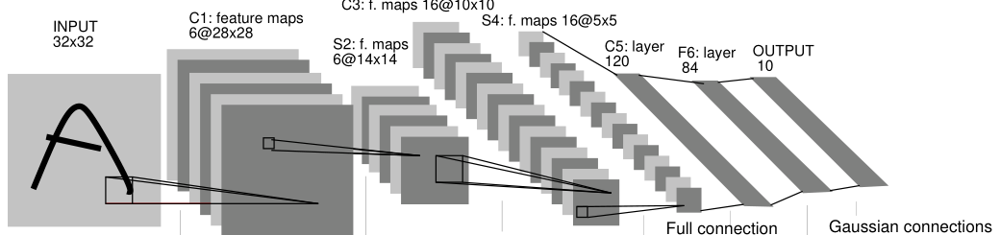

读图抓手：LeNet 是 CNN 的最小完整语法，重点看 `conv / subsampling / classifier` 如何把像素逐层压成可分类的表示。

它让视觉任务从手工特征转向端到端学习。

### AlexNet

AlexNet 不是发明 CNN，而是把 CNN 扩展到 ImageNet 级别：

```text
large supervised dataset
+ deep/wide CNN
+ GPU training
+ ReLU
+ data augmentation / dropout
-> modern visual backbone
```

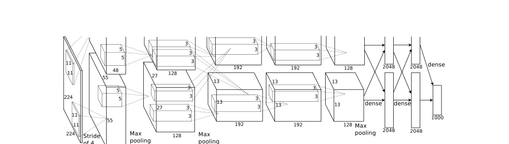

读图抓手：AlexNet 的关键不是某一个孤立模块，而是更深更宽的 CNN 在 ImageNet-scale 数据和 GPU 训练下成立。

### VGG

VGG 的关键是用简单、规整的小卷积堆深度：

```text
3x3 conv stack
-> deeper feature hierarchy
```

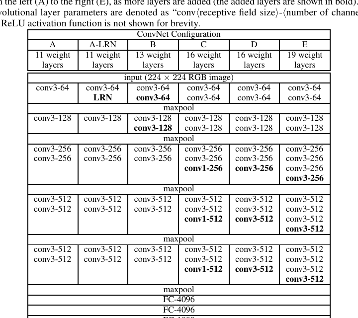

读图抓手：VGG 要记住的是配置表里的规律性：小卷积重复堆叠，通过更深的层级验证 `depth matters`。

它把 `depth matters` 这件事推到视觉 backbone 主线。

### ResNet

ResNet 回答 VGG 之后的问题：既然更深更强，为什么继续加深 plain net 反而训练误差更差？

```text
plain block:    y = H(x)
residual block: y = F(x) + x
```

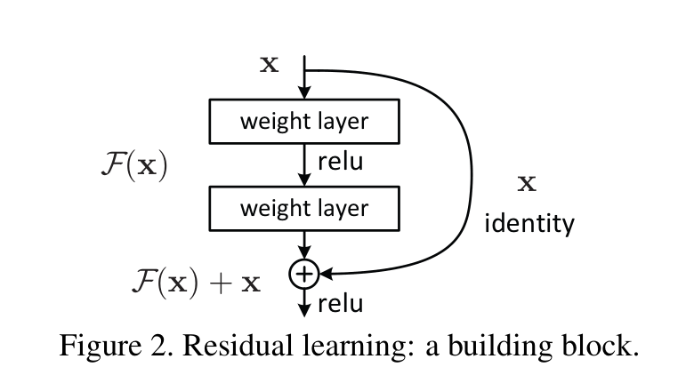

读图抓手：这张图只看一件事：shortcut 让 block 学 `F(x)` 这个 residual correction，输出再和 `x` 相加。

`F(x)+x` 让新增层学习 residual correction，而不是从零学习完整映射。它不是简单防止“训炸”，而是缓解 deep plain net 的 degradation / optimization 问题。

## 阶段 2：Visual Tokens

```text
ResNet -> ViT
```

ViT 的关键转折是把图像改造成 Transformer 能吃的序列：

```text
224x224x3 image
-> 16x16 patches
-> 196 patch vectors
-> linear projection
-> patch embeddings
-> class token + position embedding
-> Transformer encoder
```

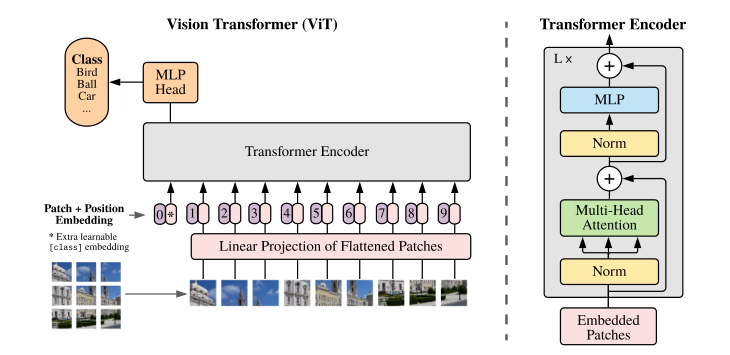

读图抓手：ViT 的关键是 `patchify -> linear projection -> class token / position embedding -> Transformer encoder`，也就是把图像改写成 Transformer 可处理的 token sequence。

这一步的价值不只是图像分类，而是为后续 VLM/VLA 准备统一接口：

```text
observation.images.<camera>
-> visual tokens
-> visual encoder
```

需要记住的边界：

- ViT 不是说“图片天然等于语言”。
- ViT 是把 image 改写成 token sequence，让 Transformer sequence modeling 可以接管视觉表征。
- ViT 相比 CNN 少了局部性和平移等 inductive bias，因此更依赖数据规模和预训练。

## 阶段 3：VLM Bridge

```text
ViT -> CLIP -> BLIP-2 -> LLaVA
```

这一段解决的是：

```text
visual tokens / visual features
-> language grounding
-> LLM-readable prompt
-> visual instruction following
```

### CLIP：image-text alignment

CLIP 的结构：

```text
image -> image encoder -> image embedding
text  -> text encoder  -> text embedding

similarity matrix = image_embeddings @ text_embeddings.T
loss = symmetric contrastive loss
```

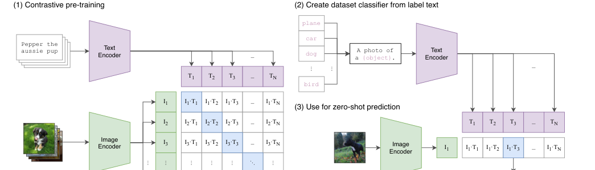

读图抓手：CLIP 不生成文本；它用 image encoder 和 text encoder 的双塔结构，把图像和自然语言标签拉到同一个 embedding space。

CLIP 的关键不是生成，而是图文对齐：

```text
image embedding <-> text embedding
```

它把固定 label-space 分类升级为 natural language supervision 下的开放语义空间。

### BLIP-2：image-to-LLM connector

BLIP-2 的结构：

```text
frozen image encoder
-> Q-Former
-> projection
-> frozen LLM
-> text generation
```

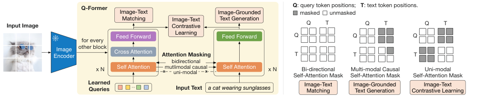

读图抓手：第一张图看 Q-Former 怎么用 learnable queries 和 frozen image encoder 的 visual features 做 cross-attention，得到少量 language-relevant visual embeddings。

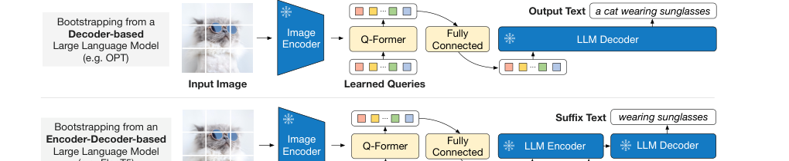

读图抓手：第二张图看 Q-Former 输出如何经过 projection 接进 frozen LLM；这里的重点是 bridge，而不是从头训练一个原生多模态大模型。

Q-Former 的作用不是直接生成可读 caption，而是用 learnable query tokens 从 frozen image encoder 的视觉特征里抽取少量、紧凑、语言相关的 visual embeddings。

Stage 1:

```text
frozen image encoder + train Q-Former
ITC / ITM / ITG
-> vision-language representation learning
```

Stage 2:

```text
Q-Former output
-> projection
-> frozen LLM embedding space
-> vision-to-language generation
```

### LLaVA：visual instruction tuning

LLaVA 的结构更直接：

```text
image
-> CLIP vision encoder
-> projector
-> LLM
-> assistant-style text response
```

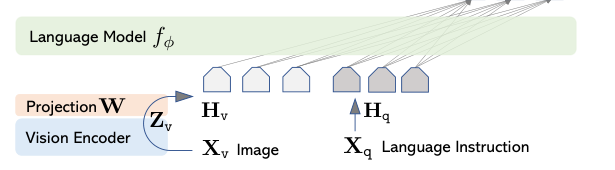

读图抓手：LLaVA 是更直接的 VLM bridge：CLIP vision encoder 提视觉特征，projector 对齐到 LLM embedding space，再用 visual instruction tuning 学会按图回答。

训练分两段：

```text
Stage 1: feature alignment
freeze vision encoder + freeze LLM
train projector

Stage 2: visual instruction tuning
freeze vision encoder
train projector + LLM
```

LLaVA 的意义是把 VLM 推到：

```text
image + instruction -> assistant text response
```

## 阶段 4：Robot Imitation Learning

```text
ALOHA / ACT
```

这一段开始真正回到机器人：

```text
observation.images
+ observation.state
-> policy
-> action
```

### ALOHA：low-cost teleoperation data system

ALOHA 是一个低成本双臂 teleoperation 和数据采集系统。


读图抓手：ALOHA 不是先讨论大模型，而是先把真实机器人 imitation learning 的数据入口做出来：leader/follower teleop、multi-view camera、joint state、target joint action。

它解决的是 imitation learning 里最实际的问题：

```text
高质量 robot demonstrations 怎么来？
```

数据接口可以抽象成：

```text
observation:
  - multi-view RGB images
  - follower joint state

action:
  - leader / teleop target joint positions

metadata:
  - task
  - episode
  - success / failure
  - timing
```

这和 LeRobot / SO-ARM101 的第一闭环高度一致。

### ACT：Action Chunking with Transformers

ACT 把普通 behavior cloning：

```text
o_t -> a_t
```

改成：

```text
o_t -> a_t:t+k
```

也就是从当前 observation 预测未来 `k` 步 action sequence。

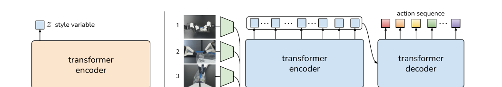

读图抓手：ACT 的图要分成两条线看：训练时用 future action chunk 通过 CVAE encoder 推出 latent `z`；推理时丢掉 encoder，设 `z=0`，由 policy Transformer 连续预测 action chunks。

它同时处理三个问题：

| 问题 | ACT 对应机制 |
|---|---|
| long-horizon compounding error | action chunking 降低有效决策 horizon |
| human demonstrations 多模态 / 不一致 | CVAE latent `z` 建模 action style |
| chunk 边界动作抖动 | temporal ensemble 融合重叠 action predictions |

训练时：

```text
sample o_t, a_t:t+k

CVAE encoder:
  current joints + true future action chunk
  -> z_mean / z_std
  -> sample z

policy Transformer:
  images_t + joints_t + z
  -> predicted action chunk

loss:
  reconstruction loss(predicted action chunk, true action chunk)
  + beta * KL(q(z | action chunk, joints) || N(0, I))
```

推理时：

```text
discard CVAE encoder
z = 0
images_t + joints_t + z
-> action chunk
-> temporal ensemble
-> execute current action
```

一个最小 toy example：

```text
k = 3
action_dim = 2

current joints = [0.10, -0.20]
future true actions =
[
  [0.20, -0.15],
  [0.35, -0.10],
  [0.50, -0.05]
]

encoder(joints, future_actions) -> z
policy(images, joints, z) -> predicted future_actions
```

ACT 的重要性不只是算法，而是它给真实机器人项目提供了一个可执行模板：

```text
teleop
-> record
-> replay
-> train ACT / BC baseline
-> eval
-> failure taxonomy
-> data iteration
```

## 阶段 5：VLA

```text
RT-2
```

RT-2 回答的问题是：

```text
VLM 能不能不只输出 text，而是直接输出 robot action？
```

原来的 VLM：

```text
image + language -> text tokens
```

RT-2 的 VLA：

```text
image + language instruction -> action tokens -> robot action
```

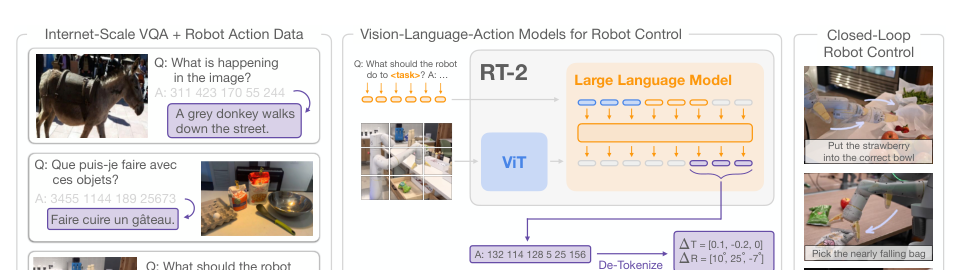

读图抓手：RT-2 的关键不是多了一个机器人外壳，而是把 robot action 离散化成 token，让 VLM 的输出空间从 text tokens 扩展到 action tokens。

核心抽象是 `action-as-token`。

RT-2 把 robot action 离散化为 token 序列：

```text
translation
rotation
gripper
terminate
-> discrete bins
-> action tokens
```

训练时做 co-fine-tuning：

```text
web-scale VQA / vision-language data
+ robot trajectory action data
-> VLM retains semantic ability
-> model learns action output
```

RT-2 转移的是 web-scale VLM 的语义能力，而不是凭空学会新物理技能：

```text
robot data teaches physical skills
web data teaches semantic grounding / reasoning
```

因此 RT-2 可以把已学会的 pick/place 等物理技能迁移到更丰富的语义指令上，但如果 robot data 里没有某类物理技能，web data 本身不会自动补出低层控制能力。

## ACT 和 RT-2 的差别

| 维度 | ALOHA / ACT | RT-2 |
|---|---|---|
| 输入 | image + robot state | image + language instruction |
| 输出 | future joint action chunk | action tokens |
| 训练数据 | teleop demonstrations | web VQA + robot trajectories |
| 模型角色 | visuomotor imitation policy | vision-language-action foundation policy |
| 解决重点 | action learning / compounding error / smooth execution | semantic generalization / action-as-token interface |
| 当前可落地性 | 高，适合 SO-ARM101 第一闭环 | 低，适合理解未来 VLA 升级路径 |

## 对 SO-ARM101 / LeRobot 的接口启发

第一阶段最终要落回真实项目接口：

```text
observation.images.<camera>
observation.state
task / language instruction
action
episode metadata
eval / failure log
```

其中：

- `CV backbone / ViT` 解释 `observation.images` 如何进入视觉编码器。
- `CLIP / BLIP-2 / LLaVA` 解释视觉如何和语言对齐、如何进入 LLM。
- `ALOHA / ACT` 解释 teleop 数据如何变成可训练 policy。
- `RT-2` 解释未来如何把 VLM 输出空间扩成 robot action。

所以当前最实际的工程路径仍然是：

```text
SO-ARM101 hardware gate
-> teleop
-> record
-> replay
-> ACT / BC baseline
-> eval / failure
-> data iteration
```

VLA 升级路径是：

```text
LeRobot dataset
-> language-labeled task data
-> OpenVLA / pi0 / SmolVLA / LingBot-style fine-tune or eval
```

## 第一阶段结论

这一阶段的闭环已经形成：

```text
CV:
  图像如何被编码成视觉表示。

VLM:
  视觉表示如何和语言对齐，并进入 LLM 生成回答。

Robot Imitation Learning:
  真实机器人如何通过 teleop 数据训练 action policy。

VLA:
  VLM 的输出空间如何扩展到 robot action。
```

一句话总结：

```text
从 CV 到 VLA 的核心，不是“模型越来越大”这一句话，而是接口逐步统一：
image -> visual tokens -> language-aligned embeddings -> LLM-compatible context -> action policy / action tokens。
```

## 下一阶段最小阅读队列

第一阶段到 RT-2 可以收口。下一阶段不再继续泛读，而是围绕 LeRobot 首闭环补缺：

| 顺序 | 材料 | 为什么读 | 读法 |
|---|---|---|---|
| 1 | DAgger | 解释 BC / ACT closed-loop covariate shift 和 data aggregation | 20-40m quick scan |
| 2 | OpenVLA | 理解 open-source VLA input/output contract、Open X 数据、fine-tune/deploy | structured awareness |
| 3 | pi0 | 理解 VLM backbone + action expert + flow matching 连续动作生成 | structured awareness |
| 4 | LeRobot docs / code | 真正推进 SO-ARM101 teleop / record / replay | 跟做，不精读 |

边界：

- 不在 SO-ARM101 没有 record/replay 前训练大 VLA。
- 不让 OpenVLA / pi0 抢走 LeRobot 第一闭环。
- 每篇后续材料都必须回答 `observation / action / data / eval / runtime` 五个问题。
